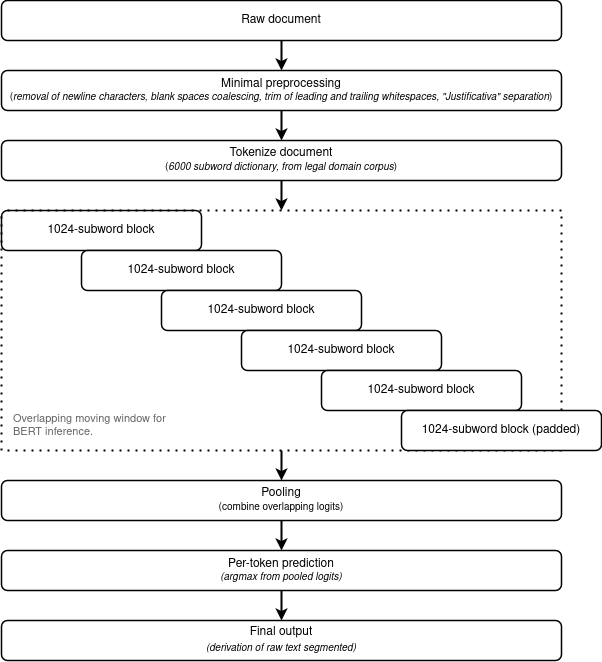

[](https://github.com/FelSiq/ulysses-segmenter/actions/workflows/tests.yml)

## Brazilian Legal Text Segmenter
This project presents a Legal Text Segmenter for Portuguese-Brazilian language.

The segmentation problem is formalized here by a 4-multiclass token-wise classification problem. Each token can be classified as follows:

|Class |Description             |
| :--- | :---                   |
|0     |No-op                   |
|1     |Start of sentence       |
|2     |Start of noise sequence |
|3     |End of noise sequence   |

---

### Table of Contents
1. [About the Model](#about-the-model)
    1. [Inference](#inference)
    2. [Training](#training)
2. [Trained models](#trained-models)
3. [Installation](#installation)
4. [Usage examples](#usage-examples)
    1. [Standard models (Torch format, Huggingface compatible)](#standard-models)
    2. [ONNX format (with support for weight quantization)](#onnx-models-with-weight-quantization)
5. [Experimental results](#experimental-results)
6. [Train data](#train-data)
7. [Package tests](#package-tests)
8. [License](#license)
9. [Citation](#citation)

---

### Model details

#### Inference
The trained models are Transformer Encoders (BERT) and Bidirectional LSTM (Bi-LSTM), with varyinng number of hidden layers (transformer blocks), and with support to up to 1024 subword tokens for BERT models. Since legal texts may exceed this limit, the present framework pre-segment the text into possibly overlapping 1024 subword windows automatically in a moving window fashion, feeding them to the Transformer Encoder independently. The encoder output is then combined ("pooled"), and the final prediction for each token is finally derived.

<p align="center">
    </img>
</p>

The *pooling* operations can be one of the following:

|Pooling                            | Description                                                                                                        |
| :---                              | :---                                                                                                               |
| Max                               | Keep maximal overlapping logits.                                                                                   |
| Sum                               | Sum overlapping logits.                                                                                            |
| Gaussian (default for Bi-LSTM)    | Weight overlapping logits by a Gaussian distribution, centered at the middle of each moving window.                |
| Assymetric-Max (default for BERT) | Keep maximal overlapping logits for all classes except "No-op" (which gets the minimal overlapping logit instead). |

#### Training
The data labeling process is semi-automatic, employing several *ad-hoc* regular expressions (available in [a notebook in this repository](./notebooks/2_generate_labels_from_regular_expressions.ipynb)).

### Trained models
TODO.

### Installation
To install this package:
```bash
python -m pip install "git+https://github.com/FelSiq/ulysses-segmenter"
```

If you plan to use optimized models in ONNX format, you need to install some optional dependencies:
```bash
python -m pip install "segmentador[optimize] @ git+https://github.com/FelSiq/ulysses-segmenter"
```

### Usage examples
#### Standard models
##### BERTSegmenter
```python
import segmentador

segmenter_bert = segmentador.BERTSegmenter(
    uri_model="<pretrained_model_path>",
    device="cpu",  # or 'cuda' for GPU
    inference_pooling_operation="assymetric-max",
)

sample_text = """
PROJETO DE LEI N. 0123 (Da Sra. Alguém)
Dispõe de algo.
O Congresso Nacional decreta:
Artigo 1. Este projeto de lei não tem efeito.
    a) Item de exemplo;
    b) Segundo item; ou
    c) Terceiro item.
Artigo 2. Esta lei passa a vigorar na data de sua publicação.
"""

seg_result = segmenter_bert(sample_text, return_logits=True)

print(seg_result.segments)
# [
#     'PROJETO DE LEI N. 0123 ( Da Sra. Alguém )',
#     'Dispõe de algo.',
#     'O Congresso Nacional decreta :',
#     'Artigo 1. Este projeto de lei não tem efeito.',
#     'a ) Item de exemplo ;',
#     'b ) Segundo item ; ou',
#     'c ) Terceiro item.',
#     'Artigo 2. Esta lei passa a vigorar na data de sua publicação.',
# ]

print(seg_result.logits)
# [[ 7.75678301  0.15893856 -2.88991857 -5.1139946 ]
#  [10.15956116 -2.35737801 -3.08267331 -4.61426926]
#  [10.86083889 -2.60591483 -4.09350395 -4.16544533]
#  ...
#  [ 9.71361065 -1.58287859 -3.04793835 -5.78309536]
#  [ 2.31029105  7.32992315 -2.93384242 -7.3394866 ]]
```

##### LSTMSegmenter
```python
import segmentador

segmenter_lstm = segmentador.LSTMSegmenter(
    uri_model="<pretrained_model_uri>",
    uri_tokenizer="<pretrained_tokenize_uri>",
    device="cpu",  # or 'cuda' for GPU
    inference_pooling_operation="gaussian",
)

sample_text = """
PROJETO DE LEI N. 0123 (Da Sra. Alguém)
Dispõe de algo.
O Congresso Nacional decreta:
Artigo 1. Este projeto de lei não tem efeito.
    a) Item de exemplo;
    b) Segundo item; ou
    c) Terceiro item.
Artigo 2. Esta lei passa a vigorar na data de sua publicação.
"""

seg_result = segmenter_lstm(sample_text, return_logits=True)

print(seg_result.segments)
# [
#    'PROJETO DE LEI N. 0123 ( Da Sra. Alguém )',
#    'Dispõe de algo.',
#    'O Congresso Nacional decreta :',
#    'Artigo 1. Este projeto de lei não tem efeito.',
#    'a ) Item de exemplo ;',
#    'b ) Segundo item ; ou',
#    'c ) Terceiro item.',
#    'Artigo 2. Esta lei passa a vigorar na data de sua publicação.',
# ]

print(seg_result.logits)
# [[  6.2647295   -8.58741379   5.64134645  -7.10431194]
#  [  7.73504782  -2.77080107  -5.28328753 -10.26550961]
#  [ 10.03150749  -7.33715487  -5.94148588  -7.88663769]
#  ...
#  [  6.64764452  -2.28969622  -3.06246185  -8.4958601 ]
#  [ -0.75093395   5.79272366   2.84845114  -8.5399065 ]]
```
#### ONNX models (with weight quantization)
We provide support for models in ONNX format (and also functions to convert from pytorch to such format), which are highly optimized and also support weight quantization. We apply 8-bit dynamic quantization.

First, in order to use models in ONNX format you need to install some optional dependencies, as shown in [Installation](#installation) section. Then, you need to create the ONNX quantized model using the `segmentador.optimize` subpackage API:
```python
import segmentador.optimize

# Load BERT Torch model
segmenter_bert = segmentador.BERTSegmenter(
    uri_model="<pretrained_model_uri>",
    device="cpu",
)

# Create ONNX BERT model
quantized_model_paths = segmentador.optimize.quantize_model(
    segmenter_bert,
    model_output_format="onnx",
    verbose=True,
)
```

Lastly, load the optimized models with appropriate classes from `segmentador.optimize` module. While the init configuration of ONNX segmenter models may differ from their standard (Torch format) version, its usage for inference remains exactly the same:

```python
# Load ONNX model
segmenter_bert_quantized = segmentador.optimize.ONNXBERTSegmenter(
    uri_model=quantized_bert_paths.output_uri,
    uri_tokenizer=segmenter_bert.tokenizer.name_or_path,
    uri_onnx_config=quantized_bert_paths.onnx_config_uri,
)

seg_result = segmenter_bert_quantized(sample_text, return_logits=True)
```

The procedure shown above is analogous for ONNX Bi-LSTM models:

```python
import segmentador.optimize

# Load Bi-LSTM standard model
segmenter_lstm = segmentador.LSTMSegmenter(
    uri_model="<pretrained_model_uri>",
    uri_tokenizer="<pretrained_tokenizer_uri>",
    device="cpu",
)

# Create ONNX Bi-LSTM model
quantized_lstm_paths = segmentador.optimize.quantize_model(
    segmenter_lstm,
    model_output_format="onnx",
    verbose=True,
)

# Load ONNX model
segmenter_lstm_quantized = segmentador.optimizer.ONNXLSTMSegmenter(
    uri_model=quantized_lstm_paths.output_uri,
    uri_tokenizer=segmenter_lstm.tokenizer.name_or_path,
)

seg_result = segmenter_lstm_quantized(curated_df_subsample, return_logits=True)
```
Bi-LSTM models can also be quantized as Torch format by setting `segmentador.optimize.quantize_model(model, model_output_format="torch", ...)`:
```Python
quantized_lstm_torch_paths = segmentador.optimize.quantize_model(
    segmenter_lstm,
    model_output_format="torch",
    verbose=True,
)

segmenter_lstm_torch_quantized = segmentador.LSTMSegmenter(
   uri_model=quantized_lstm_torch_paths.output_uri,
   uri_tokenizer=segmenter_lstm.tokenizer.name_or_path,
   from_quantized_weights=True,
)

segmenter_lstm_torch_quantized(sample_text)
```

### Experimental results
Experimental results are available in [a notebook in this repository](./notebooks/6_result_analysis.ipynb), with models tipically achieving per-class precision and recall higher than 95%, despite the problem being severely imbalanced. This same notebook also showcase some tests varying moving window size, moving window shift size, and Bidirectional LSTM models for comparison.

### Train data
TODO.

### Package tests
Tests for this package are run using Tox and Pytest.

### License
[MIT.](./LICENSE)

### Citation
```bibtex
@inproceedings{
    paper="",
    author="",
    date="",
}
```
