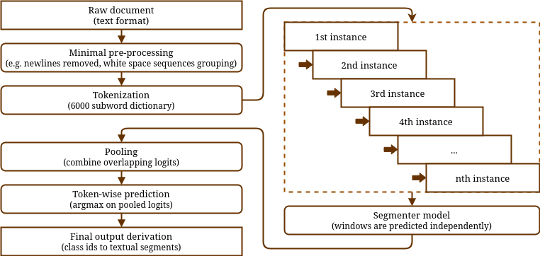

[](https://ulysses-segmenter.readthedocs.io/en/latest/?badge=latest)

## Brazilian Legislative Text Segmenter

Brazilian legislative bill segmenter models.

---

### Table of Contents
1. [Installation](#installation)
2. [Usage examples](#usage-examples)
    1. [Standard models (Torch format, Huggingface Transformers compatible)](#standard-models)
    2. [Noise subsegment removal](#noise-subsegment-removal)
    3. [Fine-tune models to your documents](#fine-tune-models-to-your-documents)
3. [Available models](#available-models)
4. [Model details](#model-details)
5. [Inference details](#inference-details)
6. [Train and evaluation data](#train-and-evaluation-data)
7. [Model quantization in ONNX format](#model-quantization-in-onnx-format)
8. [Package tests](#package-tests)
9. [License](#license)
10. [Citation](#citation)

---

### Installation

To install this package, you can use the following command:

```bash
python -m pip install "git+https://github.com/ulysses-camara/ulysses-segmenter"
```

If you intend to use optimized models in the ONNX format, you will need to install optional dependencies:

```bash
python -m pip install "segmentador[optimize] @ git+https://github.com/ulysses-camara/ulysses-segmenter"
```

---

### Usage examples

#### Standard models
Loading a model triggers download of the selected pretrained Ulysses segmenter models using [Ulysses Fetcher](https://github.com/ulysses-camara/ulysses-fetcher). Downloaded models are cached locally for future uses.

##### BERTSegmenter

```python
import segmentador

segmenter_bert = segmentador.BERTSegmenter(device="cpu")

sample_text = """
PROJETO DE LEI N. 0123 (Da Sra. Alguém)
Dispõe de algo. O Congresso Nacional decreta:
Artigo 1. Este projeto de lei não tem efeito.
    a) Item de exemplo; b) Segundo item; ou c) Terceiro item.
Artigo 2. Esta lei passa a vigorar na data de sua publicação.
"""

segments = segmenter_bert(sample_text)

print(segments)
# [
#     'PROJETO DE LEI N. 0123 ( Da Sra. Alguém )',
#     'Dispõe de algo.',
#     'O Congresso Nacional decreta :',
#     'Artigo 1. Este projeto de lei não tem efeito.',
#     'a ) Item de exemplo ;',
#     'b ) Segundo item ; ou',
#     'c ) Terceiro item.',
#     'Artigo 2. Esta lei passa a vigorar na data de sua publicação.',
# ]
```

Your can return logits and labels for each subword token:

```python
import segmentador

segmenter_bert = segmentador.BERTSegmenter(device="cpu")

sample_text = """
PROJETO DE LEI N. 0123 (Da Sra. Alguém)
Dispõe de algo. O Congresso Nacional decreta:
Artigo 1. Este projeto de lei não tem efeito.
    a) Item de exemplo; b) Segundo item; ou c) Terceiro item.
Artigo 2. Esta lei passa a vigorar na data de sua publicação.
"""

seg_result = segmenter_bert(sample_text, return_logits=True, return_labels=True)

print(seg_result.segments)
# [
#     'PROJETO DE LEI N. 0123 ( Da Sra. Alguém )',
#     'Dispõe de algo.',
#     'O Congresso Nacional decreta :',
#     'Artigo 1. Este projeto de lei não tem efeito.',
#     'a ) Item de exemplo ;',
#     'b ) Segundo item ; ou',
#     'c ) Terceiro item.',
#     'Artigo 2. Esta lei passa a vigorar na data de sua publicação.',
# ]

print(seg_result.logits)
# [[ 7.75678301  0.15893856 -2.88991857 -5.1139946 ]
#  [10.15956116 -2.35737801 -3.08267331 -4.61426926]
#  [10.86083889 -2.60591483 -4.09350395 -4.16544533]
#  ...
#  [ 9.71361065 -1.58287859 -3.04793835 -5.78309536]
#  [ 2.31029105  7.32992315 -2.93384242 -7.3394866 ]]
```

##### LSTMSegmenter
```python
import segmentador

segmenter_lstm = segmentador.LSTMSegmenter(device="cpu")

sample_text = """
PROJETO DE LEI N. 0123 (Da Sra. Alguém)
Dispõe de algo. O Congresso Nacional decreta:
Artigo 1. Este projeto de lei não tem efeito.
    a) Item de exemplo; b) Segundo item; ou c) Terceiro item.
Artigo 2. Esta lei passa a vigorar na data de sua publicação.
"""

segments = segmenter_lstm(sample_text)

print(segments)
# [
#    'PROJETO DE LEI N. 0123 ( Da Sra. Alguém )',
#    'Dispõe de algo.',
#    'O Congresso Nacional decreta :',
#    'Artigo 1. Este projeto de lei não tem efeito.',
#    'a ) Item de exemplo ;',
#    'b ) Segundo item ; ou',
#    'c ) Terceiro item.',
#    'Artigo 2. Esta lei passa a vigorar na data de sua publicação.',
# ]
```

##### Local files or Huggingface HUB models

You can also provide local models (or compatible Huggingface HUB models) to initialize the segmenter model weights by specifying the `uri_model` and `uri_tokenizer` arguments, as shown in the example below. It's important to note that BERT models typically include their own built-in tokenizer, while LSTM models do not. Therefore, providing a tokenizer model for LSTM models is necessary, whereas for BERT models, it's optional.

```python
segmenter_bert = segmentador.BERTSegmenter(
    uri_model="<path_to_local_model_or_hf_hub_model_name>",
    uri_tokenizer=None,
)

segmenter_lstm = segmentador.LSTMSegmenter(
    uri_model="<path_to_local_model>",
    uri_tokenizer="<path_to_model_tokenizer>",
)
```

---

#### Noise subsegment removal

Tokens are classified into one of four available classes: No-op (0), Segment (1), Noise Start (2), and Noise End (3). Tokens located between any pair of `Noise Start` (inclusive) and the nearest `Noise End` or `Segment` (exclusive) can be eliminated during segmentation by setting the argument `remove_noise_subsegments=True` for the segmenter model, as illustrated below:

```python
seg_result = segmenter(
    sample_text,
    ...,
    remove_noise_subsegments=True,
    maximum_noise_subsegment_length=25,
)
```

---

#### Fine-tune models to your documents

If the pretrained segmenter models are not performing satisfactorily on your documents, you can fine-tune them by providing segmented examples and using the `finetune` method as follows:

```python
import segmentador

segmenter = segmentador.BERTSegmenter()

segs = [
  "XIII - DAS RESOLUÇÕES E DAS NORMAS ESPECÍFICAS",
  "XIII.1 - O procedimento de avaliação dos protocolos de pesquisa...",
  "XIII.2 - O processo de acreditação dos Comitês de Ética em Pesquisa...",
  "XIII.3 - As especificidades éticas [NOISE_START] pág. 2 [NOISE_END] das pesquisas nas...",
]

segmenter.finetune(segs, output_uri="models/finetuned_segmenter_model")
```

To load your finetuned models:

```python
# BERT
bert_segmenter = segmentador.BERTSegmenter(uri_model="models/finetuned_segmenter_model")

# LSTM
lstm_segmenter = segmentador.LSTMSegmenter(
    uri_model="models/finetuned_segmenter_model/model.pt",
    uri_tokenizer="models/finetuned_segmenter_model",
)
```

Note that:

- The optimizer used is Adam.
- You can provide a few hyper-parameters to the optimization step. Check the `help(segmenter.finetune)` method documentation for more information.
- You can fine-tune both BERT and bi-LSTM pretrained models.
- As shown in the example above, you can mark noise sequences by enclosing them between `[NOISE_START]` and `[NOISE_END]`.
- Note that the fine-tuned model will be saved to disk only if `output_uri=...` parameter is provided. Otherwise, the fine-tuned model will just stay in memory.

---

### Available Models

We made our best models readily available for use, so that this package will download resources automatically whenever they are needed. You do not need to download them manually. However, you can access all trained models (including related datasets) to download them manually in the following locations: [Link 1](https://cloud.andrelab.icmc.usp.br/s/RZL2dzcXLoE8Yej) / [Link 2](https://drive.google.com/drive/folders/1H-MLzDEo-MmoCU5pfIRk12fkA5A7igdb?usp=sharing).

---

### Model details

The training procedure had two-stage: (1) weak supervision, involving data labeling with regular expressions, and (2) active learning, involving curation of a few selected examples.

In a curated dataset comprising 1447 ground-truth fragments of federal bills, the Ulysses Segmenter demonstrates higher precision and recall for class 1 ("Start of sentence") compared to other popular segmentation tools such as [NLTK](https://github.com/nltk/nltk), [SpaCy](https://github.com/explosion/spaCy), and [LexNLP](https://github.com/LexPredict/lexpredict-lexnlp), the latter being particularly suitable for segmenting legislative bill contents. In the table below, we provide a comparison of these algorithms against the Ulysses Segmenter, showcasing results for both estimated precision and recall.

- *v1* models were trained using weakly supervised data;
- *v2* models were trained using active learning from the corresponding *v1* model as the base model; and
- *v3* models were built on top of *v2* models to support state bills and additional legislative documents.

| Segmentation Method             | Est. Precision | Est. Recall | Size (MiB) |
|:---                             |:---            |:---         | :--------- |
| NLTK (v3.7)                     | 13.278%        | 19.738%     | --         |
| SpaCy (v3.5.0)                  | 13.422%        | 25.300%     | --         |
| LexNLP (v2.2.1.0)               | 13.462%        | 19.806%     | --         |
| Ulysses Segmenter v1 (LSTM-512) | 96.345%        | 93.004%     | 37         |
| Ulysses Segmenter v1 (BERT-2)   | 97.440%        | 93.530%     | 74         |
| Ulysses Segmenter v2 (LSTM-256) | 97.014%        | 94.909%     | **25**     |
| Ulysses Segmenter v2 (BERT-2)   | 97.981%        | 96.403%     | 74         |
| Ulysses Segmenter v2 (BERT-4)   | **98.555%**    | 96.854%     | 128        |
| Ulysses Segmenter v3 (LSTM-256) | 96.539%        | 95.953%     | **25**     |
| Ulysses Segmenter v3 (BERT-2)   | 97.850%        | 96.601%     | 74         |
| Ulysses Segmenter v3 (BERT-4)   | 98.334%        | **97.099%** | 128        |

The default models loaded for each algorithm are as follows:

- *BERT*: `4_layer_6000_vocab_size_bert_v3`.
- *Bi-LSTM Model*: `256_hidden_dim_6000_vocab_size_1_layer_lstm_v3`.
- *Tokenizer*: `6000_subword_tokenizer`.

Note that `4_layer_6000_vocab_size_bert_v3` comes with its own built-in tokenizer (which is identical to `6000_subword_tokenizer`).

---

### Inference Details

The models utilized in this package consist of Transformer Encoders (BERT) and Bidirectional LSTM (Bi-LSTM), with different numbers of hidden layers (transformer blocks) and support for up to 1,024 subword tokens in BERT models. However, given that legislative bill contents may surpass this limit, the framework automatically pre-segments the text into potentially overlapping moving windows, feeding them independently to the segmenter model. Subsequently, the model's outputs are combined ("pooled"), and the final prediction for each token is derived.

<p align="center">
  </img>
</p>

You can control the number of tokens per window, overlapping factor between windows, and the pooling operation by using the following arguments:

```python
import segmentador

bert_segmenter = segmentador.BERTSegmenter(inference_pooling_operation="sum")
text = "PROPOSTA Nro. 1234/2040 ..."
segs = bert_segmenter(text, moving_window_size=512, window_shift_size=0.25)
```

The larger the window, the more memory is required to process the sequence. Smaller `window_shift_size` fractions tend to generate more accurate results, but the execution is slower.

The *pooling* operations can be one of the following:

| Pooling         | Description                                                                                          |
| :---            | :---                                                                                                 |
| Sum (default)   | Sums overlapping logits.                                                                             |
| Max             | Retains maximal overlapping logits.                                                                  |
| Gaussian        | Weights logits using a Gaussian distribution centered in the middle of each moving window.           |
| Asymmetric-Max  | Assigns maximal logits for all classes except "No-op", which receives the minimal overlapping logit. |

---

### Train and evaluation Data

| Ver. | Dataset                                       | Size (MB) | [HF datasets](https://github.com/huggingface/datasets) format | .{tsv,csv} format      |
| :--- | :---                                          | :---      | :---              | :---             |
| v1   | Weakly supervised                             | 99.7      | [Link 1](https://cloud.andrelab.icmc.usp.br/s/NoKR3AFGysXFySH) / [Link 2](https://drive.google.com/file/d/1eD832P7r31ey8lhHqDc_uLnyg6TdKlpd/view?usp=share_link) | [Link 1](https://cloud.andrelab.icmc.usp.br/s/KfbggCyfHWknREM) / [Link 2](https://drive.google.com/file/d/1K9Ckn0Q25vLIr_8LoTcTRA2PTho36Vnn/view?usp=share_link) |
| v2   | Weak + Active supervision                     | 108.7     | [Link 1](https://cloud.andrelab.icmc.usp.br/s/WiejawW5ksJaZMS) / [Link 2](https://drive.google.com/file/d/1Wxfd4qyFCtjpsPPVY9Nx-DQYpxjQvRrJ/view?usp=share_link) | [Link 1](https://cloud.andrelab.icmc.usp.br/s/wLBHrsLfrJpm5Zk) / [Link 2](https://drive.google.com/file/d/1pjNJyd53komxvw68UanW8ESkY9ZwteDd/view?usp=share_link) |
| v2   | Active learning (curated only)                | 5.4       | [Link 1](https://cloud.andrelab.icmc.usp.br/s/eHzSR5Ai8bAEQi7) / [Link 2](https://drive.google.com/file/d/1pq6fKUJhzVQ5hcbqwrlgPeXBoFUsqFKQ/view?usp=share_link) | [Link 1](https://cloud.andrelab.icmc.usp.br/s/7Aniq5Ka9nn7Y43) / [Link 2](https://drive.google.com/file/d/1zHVFJc-QphKzrXkyuEeOeiEW2hh46Jtd/view?usp=share_link) |
| v2   | Extra: legislative amendments                 | 0.4       | [Link 1](https://cloud.andrelab.icmc.usp.br/s/KXwcmERqMwaPskd) / [Link 2](https://drive.google.com/file/d/1ywzIVarPy6JUOWDQ0-ShKDk2PaIAEs_0/view?usp=share_link) | [Link 1](https://cloud.andrelab.icmc.usp.br/s/HzpiyToAmswFSby) / [Link 2](https://drive.google.com/file/d/11jzh8kAW7hyVeiZkWkw_CJyX9xkOc5jy/view?usp=share_link) |
| v3   | State bills, Senate Procurement, Codes, Acts, CF88 | 4.7      | [Link 1](https://cloud.andrelab.icmc.usp.br/s/5zq5pHDfar5MC3p) / [Link 2](https://drive.google.com/file/d/1d7iEsojyq62S2gUm36DwEioOzN9_NBrh/view?usp=share_link)  | [Link 1](https://cloud.andrelab.icmc.usp.br/s/JryBfFfcGz9YiTZ) / [Link 2](https://drive.google.com/file/d/1_RXd9jOZESftvdNKwmj2IxuLFBm-iAzy/view?usp=share_link) |
| --   | (Publication only) International legislation (French, Italian, German, U.S.) | -- | [Link 1](https://cloud.andrelab.icmc.usp.br/s/i5ZEzXeTzLjPDrT) / [Link 2](https://drive.google.com/drive/folders/1PPAbVwSsOzmJh0Mmnt1fjLObujssXdJr?usp=drive_link) | [Link 1](https://cloud.andrelab.icmc.usp.br/s/i5ZEzXeTzLjPDrT) / [Link 2](https://drive.google.com/drive/folders/1PPAbVwSsOzmJh0Mmnt1fjLObujssXdJr?usp=drive_link) |
| --   | Raw data (unlabeled, unprocessed) | 140 | -- | [Link 1](https://cloud.andrelab.icmc.usp.br/s/zGZRN4cECSD7EoX) / [Link 2](https://drive.google.com/file/d/1QjllIfM0VeG8uPDK5G_WNXEKQnEg-FV8/view?usp=sharing) |

You can convert the HF datasets into segments using the Ulysses segmenter `.generate_segments_from_ids(input_ids=..., label_ids=...)` method as follows:

```python
import datasets
import segmentador

# NOTE: Any segmenter model will do, since they all share the same tokenizer.
segmenter = segmentador.Segmenter(device="cpu")
dt = datasets.load_from_disk("./dataset_ulysses_segmenter_train_v3")

all_segs: list[str] = []

for i, item in enumerate(dt):
    segs: list[str] = segmenter.generate_segments_from_ids(
        input_ids=item["input_ids"],
        label_ids=item["labels"],
        remove_noise_subsegments=True,
    )
    all_segs.extend(list(zip(len(segs) * [i],  segs)))

df = pd.DataFrame(all_segs, columns=["instance_id", "text"])

```

**NOTE:** Keep in mind that instances larger than 1024 subword tokens were splitted in two or more shards. Therefore, the segmentations across distinct "instance_id"'s can be unreliable.

---

### Model quantization in ONNX format

We offer support for models in ONNX format (and also functions to convert from PyTorch to such format), which are highly optimized and also support weight quantization. We apply 8-bit dynamic quantization. To utilize models in ONNX format, you need to install optional dependencies, as outlined in the [Installation](#installation) section.

Firstly, you should create the ONNX quantized model using the API provided in the `segmentador.optimize` submodule:

```python
import segmentador.optimize

# Load BERT Torch model
segmenter_bert = segmentador.BERTSegmenter()

# Create ONNX BERT model
quantized_model_paths = segmentador.optimize.quantize_model(
    segmenter_bert,
    model_output_format="onnx",
    verbose=True,
)
```

Afterward, load the optimized models with the appropriate classes from the `segmentador.optimize` module. While the configuration of the ONNX segmenter model may differ from its standard (Torch format) version, the usage for inference remains the same:

```python
# Load ONNX model
segmenter_bert_quantized = segmentador.optimize.ONNXBERTSegmenter(
    uri_model=quantized_model_paths.output_uri,
    uri_tokenizer=segmenter_bert.tokenizer.name_or_path,
)

seg_result = segmenter_bert_quantized(sample_text, return_logits=True)
```

The procedure shown above is similar for ONNX Bi-LSTM models:

```python
import segmentador.optimize

# Load Bi-LSTM standard model
segmenter_lstm = segmentador.LSTMSegmenter()

# Create ONNX Bi-LSTM model
quantized_lstm_paths = segmentador.optimize.quantize_model(
    segmenter_lstm,
    model_output_format="onnx",
    verbose=True,
)

# Load ONNX model
segmenter_lstm_quantized = segmentador.optimize.ONNXLSTMSegmenter(
    uri_model=quantized_lstm_paths.output_uri,
    uri_tokenizer=segmenter_lstm.tokenizer.name_or_path,
)

seg_result = segmenter_lstm_quantized(curated_df_subsample, return_logits=True)
```

---

### Package tests
Tests for this package are run using tox, pytest, pylint (codestyle), and mypy (static type checking).
```bash
https://github.com/ulysses-camara/ulysses-segmenter
python -m pip install ".[test]"
python -m tox
```

---

### License
[MIT.](./LICENSE)

---

### Citation

Work in progress.

```bibtex
@article{SiqueiraSegmenter2024,
  author    = {Felipe A. Siqueira and Diany Pressato and Fabíola S. F. Pereira and Nádia F. F. da Silva and Ellen Souza and Márcio S. Dias and André C. P. L. F. de Carvalho},
  title     = {Segmenting Brazilian legislative text using weak supervision and active learning},
  journal   = {Artificial Intelligence and Law},
  year      = {2024},
  doi       = {10.1007/s10506-024-09419-5},
  url       = {https://doi.org/10.1007/s10506-024-09419-5},
  issn      = {1572-8382},
  month     = sep,
  note      = {Published online 2024/09/26}
}
```
