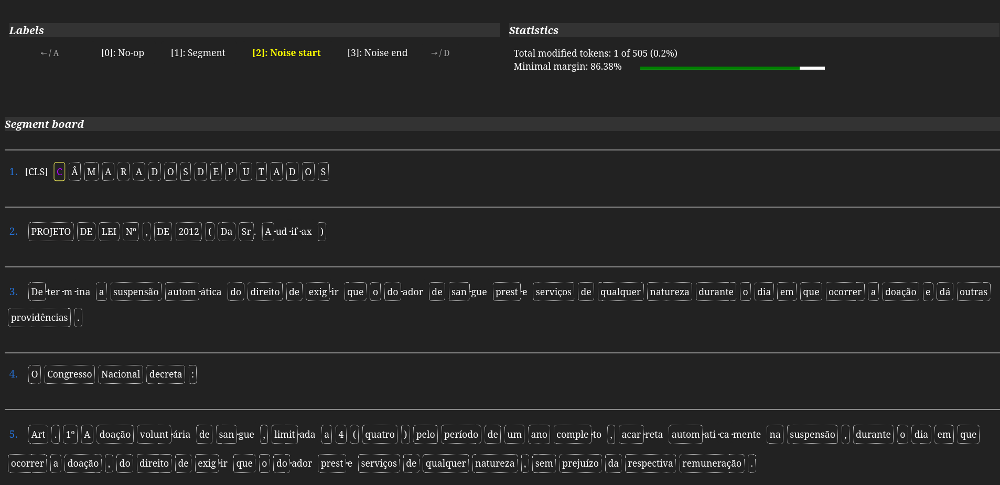
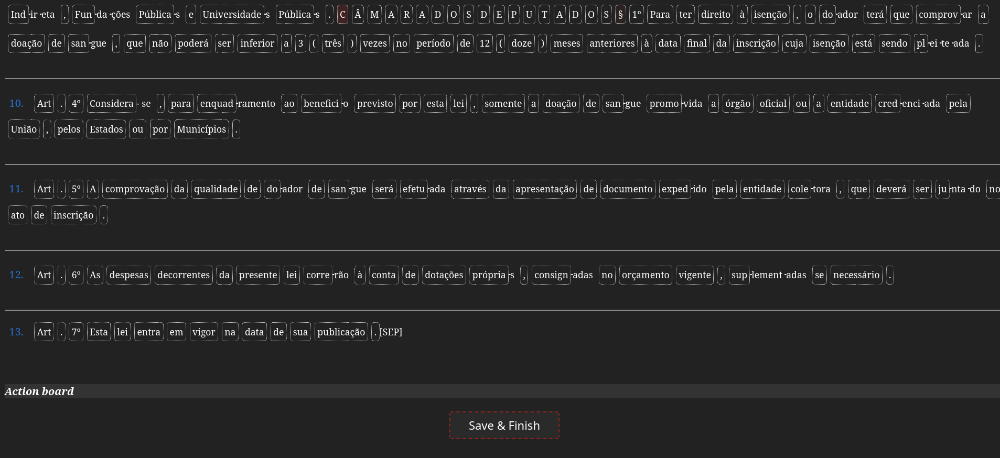

## Interactive label refinery
This is an *ad-hoc* front-end tool for legal text segmentation label adjustment. It is used in [6_refine_labels_interactively.ipynb notebook](../6_refine_labels_interactively.ipynb) to curate a test subset.

---

</img>
<p align="center">...</p>
</img>

---

### Usage:
The usage of this tool is simple. No need to install any dependency (the only external dependency of this tool is [D3](https://d3js.org/), which will be set-up automatically).

Run the flask application in your terminal either explicitly via command line, or using the Makefile:
```bash
# Using Makefile
make

# Or explicitly:
export FLASK_APP=app.py
flask run
```

Open the front-end in your web browser in the http://localhost:5000 address.

Then, import the package in your Jupyter Notebook:
```python
import interactive_labeling
```

Now you can transfer data easily between your Notebook and the front-end, by using only two functions from the provided API:
```python
# Jupyter Notebook -> Front-end
interactive_labeling.open_example(tokens=tokens, labels=labels)

# (... switch tab to front-end, refine your labels, & save results ...)

# Jupyter Notebook <- Front-end
ret = interactive_labeling.retrieve_refined_example()

print(ret["tokens"], ret["labels"])
```

---

### Additional features
There are a few options that you may find useful during your refinement.

You can use a pivot model to compute logits for each token, and provide them to the front-end. Those logits will be softmaxed (you can switch this off using `apply_softmax_to_logits=False`, in case your "logits" are actually class activations) to compute class margins (largest activation minus second largest activation). These margins will be used as a token-wise heatmap, thus providing visual information about where your pivot model was uncertain during the inference. This information may leverage your refinement process.
```python
import segmentador
model = segmentador.BERTSegmenter(uri_model="../pretrained_model/4_layer_model")
seg_result = model(tokens, return_logits=True)
interactive_labeling.open_example(tokens=tokens, labels=labels, logits=seg_result.logits)
```

You can also recover a boolean list of which tokens where modified in front-end:
```python
ret = interactive_labeling.retrieve_refined_example(return_modified_list=True)
print(ret["modified"])
```
